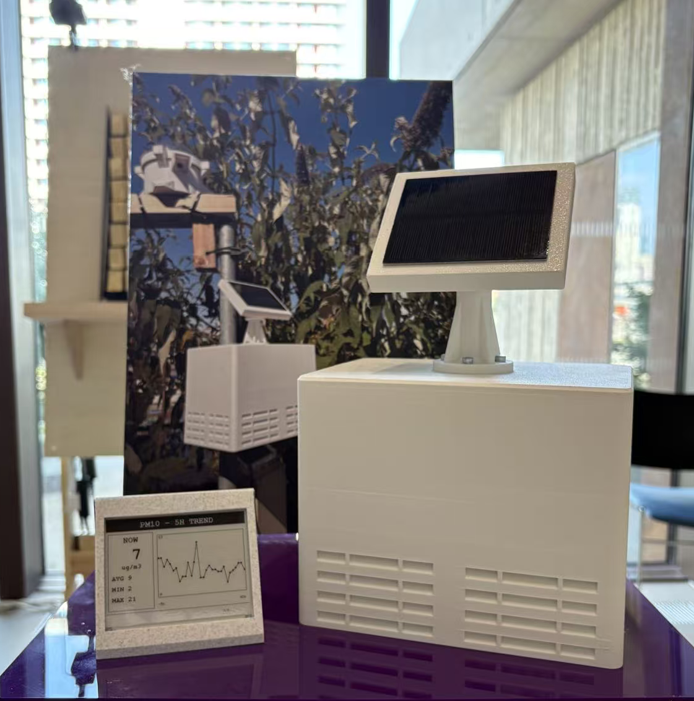
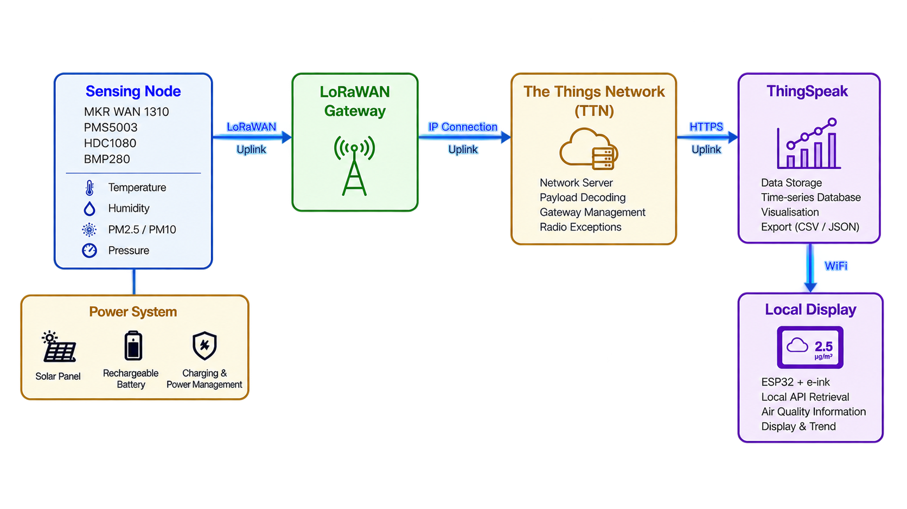
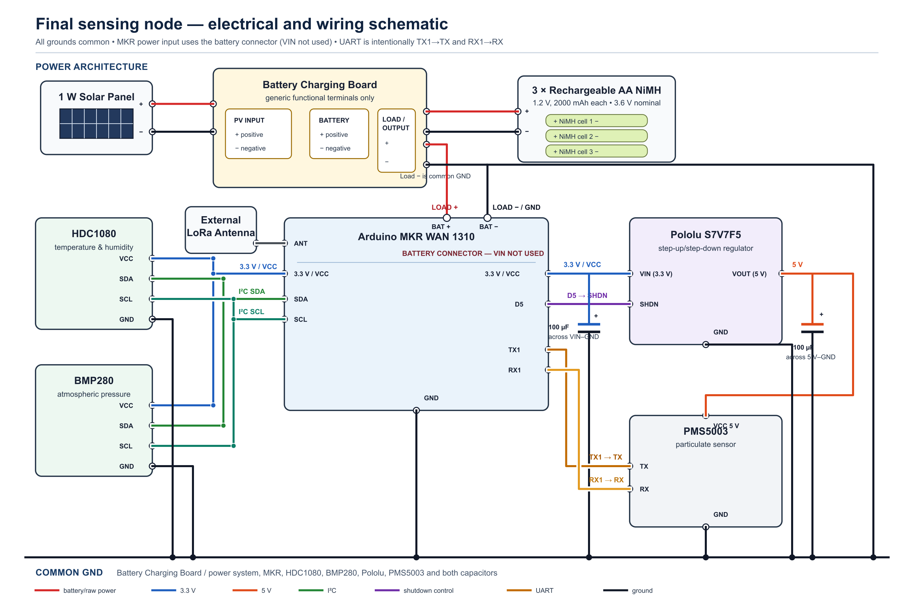
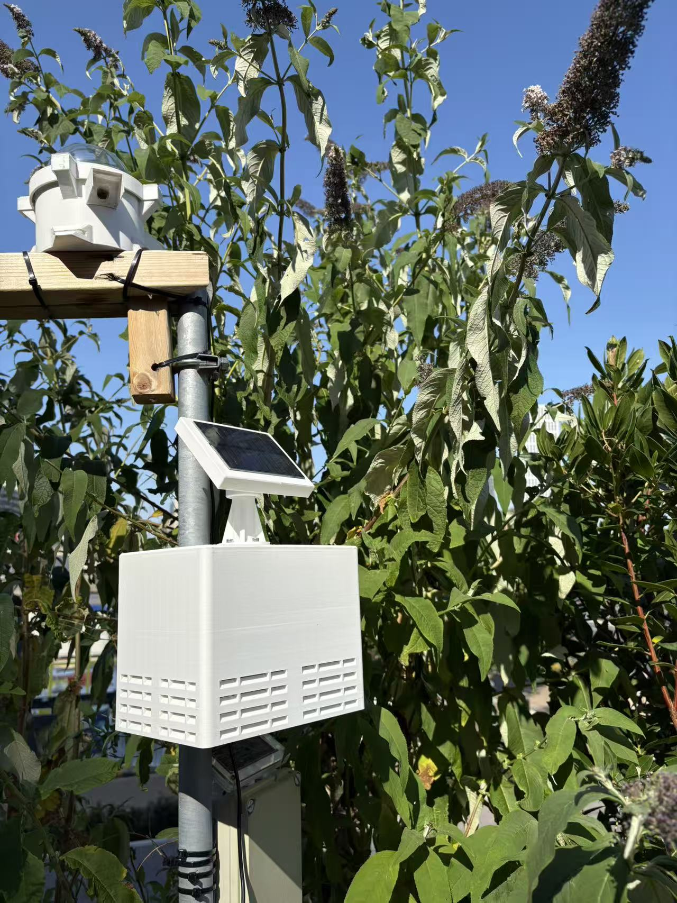
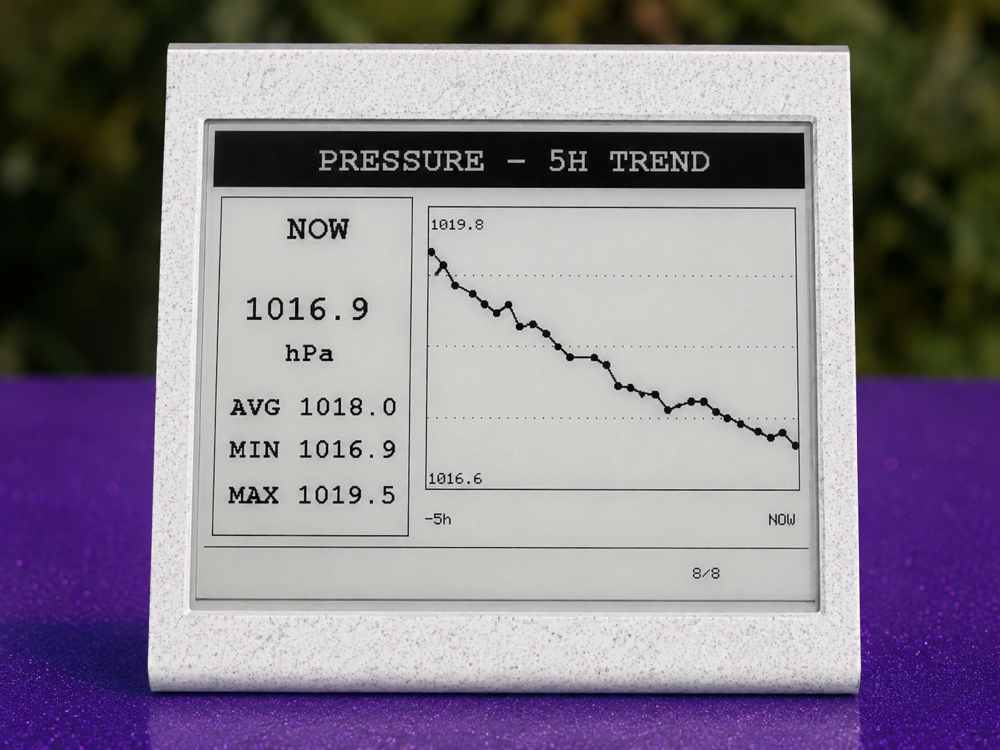

# Design and Deployment of a Solar-Powered LoRaWAN Air Quality Monitoring System



## Project overview

This project develops and deploys a solar-powered LoRaWAN air-quality sensing node to explore whether low-cost distributed sensing can contribute to denser urban monitoring where mains power is unavailable. It combines particulate and environmental sensing, low-power operation, cloud data storage and an indoor e-paper display.

The prototype demonstrates conditional viability rather than reference-grade performance. Its operation depends on adequate LoRaWAN coverage and available solar energy, and the external comparison sites were not co-located with the sensing node.

## System architecture



The deployed data pathway is:

**Sensing node → LoRaWAN gateway → The Things Network (TTN) → ThingSpeak → Wi-Fi → local ESP32 + e-paper display**

The solar-powered outdoor node sends unconfirmed LoRaWAN uplinks through a gateway to The Things Network. Decoded measurements are forwarded to ThingSpeak. The indoor display separately retrieves the ThingSpeak channel over Wi-Fi; it does not receive data directly from TTN.

## Hardware

The sensing node uses an Arduino MKR WAN 1310 with an HDC1080, BMP280 and Plantower PMS5003. A 1 W solar panel and three-cell 3.6 V nominal NiMH battery pack connect through the Battery Charging Board, whose LOAD/OUTPUT supplies the MKR battery connector. MKR VIN is not used.

The MKR 3.3 V rail powers the HDC1080, BMP280 and Pololu S7V7F5 input. The Pololu output supplies 5 V to the PMS5003; MKR D5 controls SHDN. Two 100 µF capacitors stabilise the regulator input and output rails. All grounds are common.

The final physical UART arrangement is intentional: **MKR TX1 → PMS TX** and **MKR RX1 → PMS RX**.



See the concise [bill of materials](hardware/BOM.md).

## Firmware

- [`firmware/sensing_node/`](firmware/sensing_node/) — deployed MKR WAN 1310 sensing-node firmware.
- [`firmware/display/`](firmware/display/) — deployed FireBeetle 2 ESP32-E e-paper display firmware.
- [`firmware/diagnostics/`](firmware/diagnostics/) — standalone PMS5003 diagnostic utility, **not** the deployed sensing-node firmware.

Real TTN, Wi-Fi and ThingSpeak credentials are not included. For each deployed sketch, copy `arduino_secrets.example.h` to `arduino_secrets.h`, replace the placeholders locally, and keep that local file untracked.

The display firmware retains `WiFiClientSecure.setInsecure()` to reproduce the prototype. This disables TLS certificate verification and is a known prototype security limitation; a production deployment should validate the server certificate.

## LoRaWAN payload

The MKR WAN 1310 uses OTAA in the EU868 region and sends an unconfirmed 10-byte uplink on FPort 2.

| Bytes | Measurement | Encoding |
|---:|---|---|
| 0–1 | Temperature | signed int16, °C × 100 |
| 2–3 | Relative humidity | uint16, % × 100 |
| 4–5 | PM2.5 | uint16, µg/m³ |
| 6–7 | PM10 | uint16, µg/m³ |
| 8–9 | Atmospheric pressure | uint16, hPa × 10 |

Invalid PMS readings use the uint16 sentinel `65535`. The matching [TTN uplink decoder](ttn/uplink_decoder.js) exposes both descriptive names and ThingSpeak `field1`–`field5` values; it does not add a payload flag.

## Power management

Each cycle is 10 minutes. The PMS5003/regulator branch is enabled for a 30-second sensor warm-up and switched off during sleep. The measured whole-system active current was approximately 89.6 mA for an active period of about 37–40 seconds; sleep current was approximately 137 µA. This gives an estimated cycle-average current of approximately 6.13 mA.

These measurements support the feasibility of the low-power approach, but they do not establish guaranteed year-round solar autonomy.

## Deployment

The system was deployed at the UCL One Pool Street Roof Garden.



## Evaluation and results

- ThingSpeak contains 4,961 complete records over a 38.42-day monitoring span. The median interval was 10.00 minutes, 98.79% of intervals were between 9.5 and 10.5 minutes, and the longest continuous period without a gap over one hour was approximately 34.66 days. Four early long gaps occurred during debugging, power-off and system reconfiguration, before the stable deployment period.
- The final TTN export contains 318 uplinks over approximately 2.21 days, with a 10.00-minute median interval, one absent frame counter and 994 total gateway receptions.
- Temporal comparison showed strong agreement for temperature, relative humidity and pressure; PM2.5 agreement was moderate and PM10 agreement was weak.
- The PMS5003 reported identical PM2.5 and PM10 values in 4,903 of 4,961 records (98.83%), an important limitation of this prototype dataset.

Because the Weather Underground and London Air Quality Network stations were not co-located with the project node, these results are temporal comparisons rather than formal calibration. They do not demonstrate reference-grade accuracy or validated PM10 performance.

## E-paper display



The indoor FireBeetle 2 ESP32-E display retrieves the latest ThingSpeak entry approximately every 60 seconds. When a new entry is detected it downloads 30 ten-minute samples, providing approximately five hours of history. Eight pages are shown for 20 seconds each (160 seconds per carousel); after three complete cycles, the firmware returns to a full-refresh summary page.

## CAD

The repository includes the author's editable Fusion 360 source and printable STL for the [indoor display enclosure](hardware/cad/display_enclosure/). These files are not sensing-node enclosure CAD.

The outdoor sensing enclosure's concept and functional requirements were developed through discussion involving the project author and Simon. Simon completed the detailed CAD design and 3D printing; his sensing-enclosure CAD is not published here.

## Data and analysis

- [Data documentation](data/README.md)
- [Analysis method and reproduction instructions](analysis/README.md)

The final ThingSpeak observations and metadata-minimised TTN analytical CSV are public. Raw Weather Underground and LAQN comparison files remain local because redistribution rights have not been assumed.

## Repository structure

```text
.
├── analysis/                  # Reproducible final calculations
├── data/                      # Public project and clean TTN data
├── firmware/
│   ├── sensing_node/          # Deployed outdoor-node firmware
│   ├── display/               # Deployed e-paper firmware
│   └── diagnostics/           # PMS5003 diagnostic utility
├── hardware/
│   └── cad/display_enclosure/ # Author's indoor-display CAD
├── images/                    # Selected final project images
├── ttn/                       # 10-byte uplink decoder
├── index.html                 # GitHub Pages exhibition page
└── README.md
```

## Dissertation context

This repository accompanies the CASA0022 MSc Connected Environments dissertation at University College London. It provides the technical implementation, selected data and reproducible final analysis; the dissertation PDF is not included.
